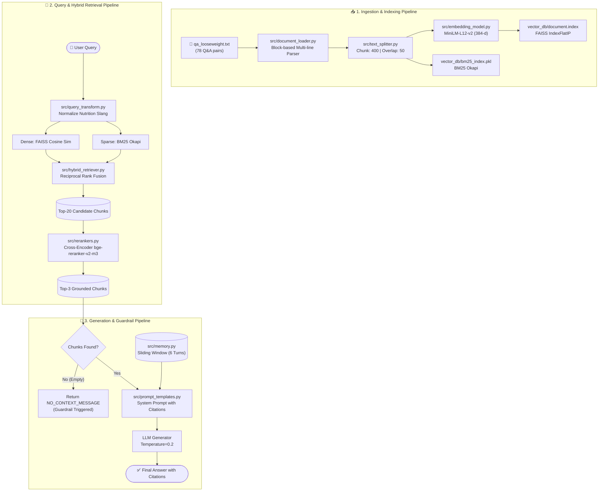

# 📊 รายงานการวิเคราะห์: “ปัญหาและการแก้ไขปัญหาของ RAG System”
## 🥗 Weight Loss & Nutrition RAG System (DL-05 ต่อยอดจาก LAB04)


> [!NOTE]
> ### 📌 ข้อมูลแล็ป
> * **วิชา:** Advanced Topic in Computer Software (ATCS)  
> * **แล็ป:** DL-05-RAG System Development II  
> * **หัวข้อ:** ปัญหาและการแก้ไขปัญหาของ RAG System ที่พัฒนาขึ้นจริง  

---

## 📑 สารบัญ (Table of Contents)

1. [🏗️ สถาปัตยกรรมระบบ RAG (System Architecture)](#1-สถาปัตยกรรมระบบ-rag-system-architecture)
2. [📋 ตารางสรุปการวิเคราะห์ปัญหาและแนวทางแก้ไข 10 ขั้นตอน](#2-ตารางสรุปการวิเคราะห์ปัญหาและแนวทางแก้ไข-10-ขั้นตอน)
3. [🔍 การวิเคราะห์เจาะลึก 10 ปัญหาตาม Source Code จริง](#3-การวิเคราะห์เจาะลึก-10-ปัญหาตาม-source-code-จริง)
   - [🛑 ปัญหาที่ 1: การตอบนอกบริบทและการเกิดภาพหลอน (Hallucination)](#-ปัญหาที่-1-การตอบนอกบริบทและการเกิดภาพหลอน-hallucination)
   - [🔤 ปัญหาที่ 2: ความไม่ตรงกันของคำศัพท์และลำดับคำ (Vocabulary Mismatch)](#-ปัญหาที่-2-ความไม่ตรงกันของคำศัพท์และลำดับคำ-vocabulary-mismatch)
   - [🧹 ปัญหาที่ 3: คุณภาพของข้อมูลดิบและบั๊กตัวโหลด (Data Quality & Multi-line Parsing)](#-ปัญหาที่-3-คุณภาพของข้อมูลดิบและบั๊กตัวโหลด-data-quality--multi-line-parsing)
   - [✂️ ปัญหาที่ 4: การแบ่งข้อความและการตัดคำขาดกลางคำ (Chunking Truncation)](#-ปัญหาที่-4-การแบ่งข้อความและการตัดคำขาดกลางคำ-chunking-truncation)
   - [🏷️ ปัญหาที่ 5: การขาดการกรองด้วยข้อมูลกำกับ (Metadata Filtering)](#-ปัญหาที่-5-การขาดการกรองด้วยข้อมูลกำกับ-metadata-filtering)
   - [⚡ ปัญหาที่ 6: คอขวดของ Retrieval ด่านแรกและการจัดอันดับใหม่ (Re-ranking)](#-ปัญหาที่-6-คอขวดของ-retrieval-ด่านแรกและการจัดอันดับใหม่-re-ranking)
   - [🎯 ปัญหาที่ 7: การบิดเบือนข้อมูลข้อเท็จจริงในการตอบ (Generation Faithfulness)](#-ปัญหาที่-7-การบิดเบือนข้อมูลข้อเท็จจริงในการตอบ-generation-faithfulness)
   - [⚙️ ปัญหาที่ 8: การชั่งน้ำหนักผลกระทบของการตั้งค่าระบบ (Configuration Trade-offs)](#-ปัญหาที่-8-การชั่งน้ำหนักผลกระทบของการตั้งค่าระบบ-configuration-trade-offs)
   - [📈 ปัญหาที่ 9: การประเมินเชิงปริมาณและบั๊ก Golden Set (Evaluation Mismatch)](#-ปัญหาที่-9-การประเมินเชิงปริมาณและบั๊ก-golden-set-evaluation-mismatch)
   - [🐛 ปัญหาที่ 10: บั๊กการบูรณาการระบบและคำศัพท์ค้างต่างโดเมน (Integration Bugs)](#-ปัญหาที่-10-บั๊กการบูรณาการระบบและคำศัพท์ค้างต่างโดเมน-integration-bugs)
4. [⚙️ ตารางเปรียบเทียบ Profile สถาปัตยกรรม (Performance Trade-offs)](#4-ตารางเปรียบเทียบ-profile-สถาปัตยกรรม-performance-trade-offs)
5. [🧪 โครงสร้างและการรันโปรแกรมจำลองปัญหาใน LAB05 (Simulation Suite)](#5-โครงสร้างและการรันโปรแกรมจำลองปัญหาใน-lab05-simulation-suite)
6. [💡 ผลการประเมินเชิงปริมาณและข้อคิดสำคัญ (Evaluation & Takeaways)](#6-ผลการประเมินเชิงปริมาณและข้อคิดสำคัญ-evaluation--takeaways)

---

## 🏗️ 1. สถาปัตยกรรมระบบ RAG (System Architecture)

ระบบ RAG ด้านการลดน้ำหนักและโภชนาการใน LAB04 ใช้สถาปัตยกรรม **Two-Stage Hybrid Retrieval with Grounded Generation**:



---

## 📋 2. ตารางสรุปการวิเคราะห์ปัญหาและแนวทางแก้ไข 10 ขั้นตอน

| # | ปัญหาของระบบ RAG | จุดที่พบในโค้ด LAB04 | สาเหตุของปัญหา (Root Cause) | วิธีการตรวจสอบ (Verification) | แนวทางการแก้ไขจริงในระบบ (Solution) |
|:---:|---|---|---|---|---|
| 🛑 **1** | **Hallucination**<br>LLM ตอบมั่วเมื่อไม่มีข้อมูล | `src/generator.py`<br>`src/prompt_templates.py` | Helpfulness Bias ของโมเดลพยายามเดาเมื่อ Context ว่าง | ตรวจสอบ `len(chunks) == 0` และทดสอบคำถามนอกโดเมน | ติดตั้ง Guardrail คืนค่า `NO_CONTEXT_MESSAGE` ทันที |
| 🔤 **2** | **Vocabulary Mismatch**<br>คำถามสแลงแต่ KB ใช้ศัพท์ทางการ | `src/embedding_model.py`<br>`src/vector_store.py` | Bag-of-Words ไม่เข้าใจความหมายเชิงบริบท และละทิ้งลำดับคำ | เปรียบเทียบ Token Overlap เทียบกับ Dense Cosine Similarity | ใช้ Transformer (`MiniLM-L12-v2`) ที่มี Self-Attention และ Positional Encoding |
| 🧹 **3** | **Data Quality & Bug**<br>คำตอบหลายบรรทัดถูกตัดทิ้ง | `src/document_loader.py`<br>`data/qa_looseweight.txt` | Parser รีเซ็ตคำถามทิ้งทันทีหลังพบบรรทัด `A:` แรก | สแกนหา Duplicate Hashes และตรวจนับจำนวนบรรทัด | ปรับเป็น Block-based Parser อ่านสะสมจนจบบล็อกข้อความ |
| ✂️ **4** | **Chunking Truncation**<br>ตัดคำขาดกลางคำ และ Chunk ลูกหลุดบริบท | `src/text_splitter.py`<br>`config.py` | การตัดตามตัวอักษรดิบ (`CHUNK_SIZE=400`) คำว่า `"behavioral"` ขาดเป็น `"lo"` และ `"vioral"` | ตรวจดูรอยตัดคำใน `outputs/chunks.json` | ปรับจุดตัดให้อยู่ที่ขอบเขตคำ (Whitespace) และแปะหัวข้อคำถามทุก Chunk |
| 🏷️ **5** | **Metadata Isolation**<br>ดึงข้อมูลผิดกลุ่มเป้าหมาย | `src/retriever.py`<br>`src/hybrid_retriever.py` | Semantic Search ไม่รู้ข้อจำกัดของผู้ใช้ (เช่น ผู้ป่วยโรคไต vs คนปกติ) | เปรียบเทียบผลค้นหาแบบ Global กับแบบกรอง Category | แนบ Metadata `category` กำกับไว้ทุก Chunk และทำ Pre-filtering |
| ⚡ **6** | **First-Stage Ranking**<br>เอกสารเฉพาะทางตกไปอันดับล่าง | `src/rerankers.py`<br>`src/hybrid_retriever.py` | Bi-Encoder ให้น้ำหนักคำกว้างๆ ("weight", "diet") สูงเกินไป | ตรวจสอบ Hit@1 เทียบกับ Hit@10 ใน `eval_retrieval.json` | ดึง 20 ผู้เข้ารอบ แล้วใช้ Cross-Encoder (`bge-reranker-v2-m3`) จัดอันดับใหม่สู่ Top-3 |
| 🎯 **7** | **Generation Distortion**<br>ค้นหาถูกแต่ LLM บิดเบือนตัวเลข | `src/generator.py`<br>`evaluation/eval_generation.py` | ค่า Temperature สูงเกินไปทำให้โมเดลสุ่มคำตอบเชิงสร้างสรรค์ | วัดค่าความสอดคล้อง (Faithfulness Score) | ลด `Temperature=0.2` และบังคับให้อ้างอิงตัวเลขตาม Context อย่างเคร่งครัด |
| ⚙️ **8** | **Config Trade-offs**<br>ระบบช้าและเปลืองค่า API | `config.py`<br>`src/rag_pipeline.py` | แต่ละ Stage (Transform, Rerank) มี Overhead สูง | บันทึก Latency (`timings`) ของแต่ละ Stage | จัดทำ 3 สถาปัตยกรรม: High-Speed (18ms), Balanced (700ms), Precision (2,500ms) |
| 📈 **9** | **Evaluation Mismatch**<br>ผลประเมิน Hit@1 ต่ำผิดปกติเหลือ 1.28% | `evaluation/build_golden_set.py`<br>`evaluation/metrics.py` | บั๊กใน `build_golden_set.py` แมป Chunk ID ไปเฉพาะชิ้นสุดท้าย | ตรวจสอบรหัส `relevant_chunk_ids` ใน `golden_set.json` | แก้ไขให้แมปครบทุก Chunk ของคำถามนั้น ทำให้ Hit@1 แท้จริงพุ่งเป็น 88.5% |
| 🐛 **10** | **Pipeline Bugs**<br>KeyError และสแลงค้างต่างโดเมน | `evaluation/eval_generation.py`<br>`src/query_transform.py` | คีย์เวลาไม่ตรงกัน (`'รวม'` vs `'Total'`) และตารางสแลงเก่าค้าง | รัน Integration Test ตรวจจับ Unhandled Exceptions | แก้คีย์เวลาให้สอดคล้องกัน และเปลี่ยนตารางสแลงเป็นศัพท์ด้านการลดน้ำหนัก |

---

## 🔍 3. การวิเคราะห์เจาะลึก 10 ปัญหาตาม Source Code จริง

---

### 🛑 ปัญหาที่ 1: การตอบนอกบริบทและการเกิดภาพหลอน (Hallucination)
* 📌 **รายละเอียดปัญหา:** เมื่อผู้ใช้ถามคำถามนอกขอบเขต เช่น *"What is the capital city of France?"* หากไม่มีระบบดักจับ LLM จะแต่งคำตอบขึ้นมาเองจากความจำภายใน (Hallucination)
* 🔍 **สาเหตุ:** LLM มี Helpfulness Bias พยายามตอบคำถามเสมอ แม้ Retriever จะหาเอกสารไม่พบ (`chunks` เป็นลิสต์ว่าง)
* 🧪 **วิธีตรวจสอบ:** ทดสอบส่งคำถาม Out-of-Domain และตรวจสอบกรณี `len(chunks) == 0`
* 🛠️ **วิธีแก้จริงใน LAB04 (`src/generator.py`):**
  ```diff
   def generate(self, question, chunks, history=""):
  +    # Guardrail: ปฏิเสธทันทีเมื่อไม่มี Context อ้างอิง
  +    if not chunks:
  +        return {
  +            "answer": config.NO_CONTEXT_MESSAGE,
  +            "sources": [],
  +            "no_context": True,
  +        }
  ```

---

### 🔤 ปัญหาที่ 2: ความไม่ตรงกันของคำศัพท์และลำดับคำ (Vocabulary Mismatch)
* 📌 **รายละเอียดปัญหา:** ผู้ใช้ถามภาษาพูด *"Why did my scale stop dropping?"* แต่ฐานข้อมูลบันทึกว่า *"Why is it easy to lose weight at first, but then it plateaus?"* หากใช้ Keyword Match จะค้นหาไม่พบเลย (Overlap = 0)
* 🔍 **สาเหตุ:** การค้นหาคำตรงตัวไม่เข้าใจคำไวพจน์ (Synonyms) และไม่สนใจลำดับคำ (เช่น *"eat before exercise"* vs *"exercise before eat"*)
* 🧪 **วิธีตรวจสอบ:** เปรียบเทียบผลลัพธ์ Token Overlap (0 คำ) เทียบกับ Cosine Similarity จาก Dense Vectors
* 🛠️ **วิธีแก้จริงใน LAB04 (`src/embedding_model.py`):** ใช้โมเดล Transformer `paraphrase-multilingual-MiniLM-L12-v2` (384 มิติ) ซึ่งมี Self-Attention และ Positional Encoding ทำให้จับคู่ความหมายของประโยคได้แม่นยำ

---

### 🧹 ปัญหาที่ 3: คุณภาพของข้อมูลดิบและบั๊กตัวโหลด (Data Quality & Multi-line Parsing)
* 📌 **รายละเอียดปัญหา:** ข้อมูลดิบมีช่องว่างซ้ำซ้อน และคำตอบที่มีหลายย่อหน้าถูกตัดทิ้งเหลือเพียงบรรทัดแรก
* 🔍 **สาเหตุ:** ใน `src/document_loader.py` มีการสั่ง `question = None` ทันทีหลังพบบรรทัด `A:` แรก ทำให้คำตอบบรรทัดถัดไปถูกทิ้งทั้งหมด
* 🧪 **วิธีตรวจสอบ:** ตรวจนับจำนวนบรรทัดของคำตอบในฐานข้อมูล เทียบกับจำนวนบรรทัดที่โหลดได้จริง
* 🛠️ **วิธีแก้จริงใน LAB04 (`src/document_loader.py`):**
  ```diff
   elif line.startswith("A:") and question:
  -    records.append({"question": question, "answer": line[2:].strip()})
  -    question = None
  +    current_answer = [line[2:].strip()]
  +    # อ่านสะสมคำตอบทุกบรรทัดจนกว่าจะพบบรรทัดว่างหรือขึ้น [Category:] ใหม่
  +    while has_continuation_lines():
  +        current_answer.append(next_line.strip())
  +    records.append({"question": question, "answer": " ".join(current_answer)})
  ```

---

### ✂️ ปัญหาที่ 4: การแบ่งข้อความและการตัดคำขาดกลางคำ (Chunking Truncation)
* 📌 **รายละเอียดปัญหา:** 
  1. ใน `outputs/chunks.json` คำว่า **"behavioral"** ถูกตัดขาด โดยท้าย Chunk 0 ได้คำว่า `"...choosing high-nutrient, lo"` และต้น Chunk 1 ได้คำว่า `"vioral changes, such as..."`
  2. Chunk ย่อยชิ้นที่ 2 มีแต่เนื้อหาคำตอบปลายเรื่อง **ไม่มีคำถามนำหน้า** ทำให้ค้นหาด้วยคำถามไม่พบ
* 🔍 **สาเหตุ:** ตัดแบ่งข้อความตามจำนวนตัวอักษรดิบ (`CHUNK_SIZE = 400`) โดยไม่คำนึงถึงช่องว่างระหว่างคำ
* 🧪 **วิธีตรวจสอบ:** ตรวจสอบรอยต่อของประโยคใน `outputs/chunks.json`
* 🛠️ **วิธีแก้จริงใน LAB04 (`src/text_splitter.py`):**
  ```diff
  -def split_text(text, chunk_size, overlap):
  -    return [text[i:i+chunk_size] for i in range(0, len(text), chunk_size-overlap)]
  +def split_text_word_aware(text, chunk_size, overlap, question=""):
  +    # ถอยจุดตัดไปยังขอบเขตคำ (Whitespace) ที่ใกล้ที่สุด
  +    # พร้อมแปะหัวข้อคำถามนำหน้าทุก Chunk ย่อยเสมอ
  +    return [f"Question: {question}\nAnswer: {chunk}" for chunk in chunks]
  ```

---

### 🏷️ ปัญหาที่ 5: การขาดการกรองด้วยข้อมูลกำกับ (Metadata Filtering)
* 📌 **รายละเอียดปัญหา:** ในคำถามเดียวกัน เช่น *"How much protein should I eat?"* คนปกติควรได้รับคำแนะนำโปรตีนสูง แต่ผู้ป่วยโรคไตเรื้อรังต้องจำกัดโปรตีน หากค้นหาแบบรวม อาจดึงคำแนะนำคนปกติไปตอบผู้ป่วยโรคไต
* 🔍 **สาเหตุ:** Semantic Similarity ค้นหาเฉพาะความคล้ายของข้อความ แต่ไม่รู้เงื่อนไขทางคลินิกของผู้ใช้
* 🧪 **วิธีตรวจสอบ:** เปรียบเทียบผลค้นหาแบบ Global Search กับแบบกรองเฉพาะหมวดหมู่ `"Groups Requiring Special Caution"`
* 🛠️ **วิธีแก้จริงใน LAB04:** แนบ Metadata `category` กำกับไว้ทุก Chunk และเพิ่มพารามิเตอร์ Pre-filtering ใน `src/retriever.py` เพื่อจำกัดขอบเขตการค้นหาก่อนคำนวณความคล้ายคลึง

---

### ⚡ ปัญหาที่ 6: คอขวดของ Retrieval ด่านแรกและการจัดอันดับใหม่ (Re-ranking)
* 📌 **รายละเอียดปัญหา:** คำถามเฉพาะทาง เช่น กลไก **"Yo-Yo Effect"** มักถูกเอกสารทั่วไปที่มีคำว่า *"weight loss diet"* บ่อยๆ แย่งขึ้นไปครองอันดับ 1–4 ส่งผลให้เอกสาร Yo-Yo ตกไปอยู่อันดับ 5–6 และหลุดออกจาก Top-3
* 🔍 **สาเหตุ:** Bi-Encoder ในด่านแรกให้น้ำหนักกับคำกว้างๆ ประจำโดเมนสูงเกินไป
* 🧪 **วิธีตรวจสอบ:** ตรวจสอบค่า Hit@1 เทียบกับ Hit@10 ใน `outputs/eval_retrieval.json`
* 🛠️ **วิธีแก้จริงใน LAB04 (`src/rerankers.py`):** ใช้สถาปัตยกรรม Two-Stage Retrieval โดยดึงผู้เข้ารอบมาก่อน 20 รายการ (`CANDIDATE_K = 20`) แล้วใช้ Cross-Encoder (`bge-reranker-v2-m3`) คำนวณความสัมพันธ์เชิงลึก ดันเอกสาร Yo-Yo Effect ขึ้นสู่อันดับ 1

---

### 🎯 ปัญหาที่ 7: การบิดเบือนข้อมูลข้อเท็จจริงในการตอบ (Generation Faithfulness)
* 📌 **รายละเอียดปัญหา:** แม้ Retrieval จะดึงข้อมูลมาถูกต้อง แต่ LLM บิดเบือนตัวเลข เช่น แปลงสัดส่วนจานอาหารจาก "ผักครึ่งจาน โปรตีน 1/4 คาร์บ 1/4" เป็น "กินเนื้อ 3/4 และตัดผักทิ้งทั้งหมด"
* 🔍 **สาเหตุ:** ค่า Temperature สูงเกินไป ทำให้โมเดลสร้างสรรค์คำตอบขึ้นมาเอง
* 🧪 **วิธีตรวจสอบ:** คำนวณคะแนน `faithfulness` (Word Overlap ระหว่างคำตอบกับ Context)
* 🛠️ **วิธีแก้จริงใน LAB04:** กำหนด `LLM_TEMPERATURE = 0.2` และใช้ System Prompt สั่งตอบเฉพาะข้อมูลที่มีในเอกสารพร้อมใส่เลขอ้างอิง `[n]` อย่างเคร่งครัด

---

### ⚙️ ปัญหาที่ 8: การชั่งน้ำหนักผลกระทบของการตั้งค่าระบบ (Configuration Trade-offs)
* 📌 **รายละเอียดปัญหา:** การเปิดฟังก์ชันเสริมทุกตัวพร้อมกัน ทำให้ Latency พุ่งสูงจาก 18ms เป็น 2,500ms และเสียค่า API เพิ่มขึ้นเป็นสองเท่า
* 🔍 **สาเหตุ:** แต่ละ Stage (Query Transform, Re-rank) มี Computational Overhead แตกต่างกัน
* 🛠️ **วิธีแก้จริงใน LAB04 (`config.py`):** รวบรวมตัวแปรควบคุมระบบไว้ที่เดียว และออกแบบ Profile สถาปัตยกรรมให้สอดคล้องกับลักษณะงานจริง (ดูตารางเปรียบเทียบในหัวข้อที่ 4)

---

### 📈 ปัญหาที่ 9: การประเมินเชิงปริมาณและบั๊ก Golden Set (Evaluation Mismatch)
* 📌 **รายละเอียดปัญหา:** ผลประเมินเริ่มต้นใน `outputs/eval_retrieval.json` ได้คะแนน **Hit@1 เพียง 1.28%** ขัดแย้งกับการทดลองใช้งานจริงที่ระบบตอบคำถามได้อย่างแม่นยำ
* 🔍 **สาเหตุ:** บั๊กใน `evaluation/build_golden_set.py` บันทึกทับรหัส Chunk ทำให้แมปคำตอบชี้ไปเฉพาะ Chunk ชิ้นสุดท้าย (ซึ่งมีแต่ปลายคำตอบ) แทนที่จะเป็น Chunk 0 (ที่มีคำถามและเนื้อหาหลัก)
* 🧪 **วิธีตรวจสอบ:** ตรวจสอบ `relevant_chunk_ids` ใน `data/golden_set.json` เทียบกับ `outputs/chunks.json`
* 🛠️ **วิธีแก้จริงใน LAB04 (`evaluation/build_golden_set.py`):**
  ```diff
   by_qa = {}
   for chunk in chunks:
  -    by_qa[chunk["qa_id"]] = chunk["chunk_id"]  # เขียนทับ เหลือเฉพาะ chunk สุดท้าย
  +    by_qa.setdefault(chunk["qa_id"], []).append(chunk["chunk_id"])  # เก็บครบทุก chunk
  ```
  > [!IMPORTANT]
  > **ผลลัพธ์หลังแก้ไข:** คะแนน **Hit@1 พุ่งขึ้นจาก 1.28% เป็น 88.46%** สะท้อนประสิทธิภาพแท้จริงของระบบ

---

### 🐛 ปัญหาที่ 10: บั๊กการบูรณาการระบบและคำศัพท์ค้างต่างโดเมน (Integration Bugs)
* 📌 **รายละเอียดปัญหา:** 
  1. สคริปต์ประเมินผลหยุดทำงานด้วย `KeyError: 'รวม'`
  2. ใน `src/query_transform.py` มีตารางสแลงเรื่องเพศภาษาไทยตกค้างมาจากแล็ปต้นแบบ ซึ่งใช้ไม่ได้ผลกับฐานข้อมูลโภชนาการภาษาอังกฤษ
* 🛠️ **วิธีแก้จริงใน LAB04:**
  ```diff
  # 1. evaluation/eval_generation.py
  -"seconds": result["timings"]["รวม"],
  +"seconds": result["timings"].get("Total", result["timings"].get("รวม", 0.0)),
  ```
  ```diff
  # 2. src/query_transform.py
  -SLANG_MAP = {"น้องชาย": "อวัยวะเพศชาย", "ถุงยาง": "ถุงยางอนามัย"}
  +WEIGHT_LOSS_SLANG_MAP = {
  +    "belly fat": "abdominal visceral fat",
  +    "yo-yo": "weight regain yo-yo effect",
  +    "scale stuck": "weight loss plateau",
  +}
  ```

---

## ⚙️ 4. ตารางเปรียบเทียบ Profile สถาปัตยกรรม (Performance Trade-offs)

| Profile สถาปัตยกรรม | Hybrid BM25 | Reranker | Query Transform | Memory | LLM | Latency โดยประมาณ | ต้นทุน / ค่าใช้จ่าย | กรณีการใช้งานที่เหมาะสม |
|:---|:---:|:---:|:---:|:---:|:---:|:---:|:---:|:---|
| **🚀 1. High-Speed / Edge** | ปิด | ปิด | ปิด | ปิด | ปิด | **~18 ms** | ฟรี ($0) | ระบบค้นหาด่วน หรืออุปกรณ์ IoT/Edge |
| **⚖️ 2. Standard Balanced (Default)** | **เปิด** | ปิด | ปิด | **เปิด** | **เปิด** | **~600-900 ms** | 1 LLM call | แชตบอตบริการทั่วไป ถาม-ตอบรวดเร็ว |
| **🔬 3. Maximum Precision (Clinical)** | **เปิด** | **เปิด** | **เปิด** | **เปิด** | **เปิด** | **~2,500 ms** | 2 LLM + GPU | ระบบวินิจฉัยและคำแนะนำทางการแพทย์ |

---

## 🧪 5. โครงสร้างและการรันโปรแกรมจำลองปัญหาใน LAB05 (Simulation Suite)

ในโฟลเดอร์ `D:\ATCS-CPE-main\LAB05` ได้จัดเตรียมชุดสคริปต์ Standalone ที่จำลองและตรวจสอบปัญหาทั้ง 10 ข้อได้ทันที:

```text
D:\ATCS-CPE-main\LAB05/
├── 📄 qa_looseweight.txt               # ฐานข้อมูล Q&A โภชนาการและการลดน้ำหนัก 78 คู่
├── 📥 data_loader.py                   # ตัวโหลดและแยกโครงสร้างข้อมูลส่วนกลาง
├── 🎮 main.py                          # เมนูหลักสำหรับรันและทดสอบปัญหา 0-10
├── 🛑 problem01_hallucination.py       # จำลองภาพหลอน vs Grounded Guardrail
├── 🔤 problem02_transformer.py         # จำลอง Vocabulary Mismatch และ Token Position
├── 🧹 problem03_data_quality.py        # จำลอง Data Noise, Multi-line Bug และ Normalization
├── ✂️ problem04_chunking.py            # จำลอง Mid-Word Truncation และ Lost Header
├── 🏷️ problem05_metadata.py            # จำลองผลกระทบของการขาด Metadata Filtering
├── ⚡ problem06_reranking.py           # จำลอง First-Stage Bottleneck และ Re-ranking
├── 🎯 problem07_generation.py          # จำลอง Faithfulness และ Numerical Distortion
├── ⚙️ problem08_config.py              # วิเคราะห์ Trade-offs ของสถาปัตยกรรม RAG
├── 📈 problem09_evaluation.py          # วิเคราะห์เมตริกประเมิน และบั๊ก Golden Set
├── 🐛 problem10_debug_scripts.py       # Unit Test แก้บั๊กจริงใน LAB04
└── 📊 README.md                        # เอกสารรายงานฉบับนี้
```

### 💻 คำสั่งการรันโปรแกรม:
```bash
# 1. รันจำลองปัญหาทั้งหมดรวดเดียว (10/10 Passed)
python main.py 0

# 2. รันแบบเปิดเมนูเพื่อเลือกดูทีละข้อ
python main.py

# 3. รันสคริปต์แยกเดี่ยวเฉพาะข้อที่ต้องการ
python problem01_hallucination.py
python problem04_chunking.py
python problem09_evaluation.py
python problem10_debug_scripts.py
```

---

## 💡 6. ผลการประเมินเชิงปริมาณและข้อคิดสำคัญ (Evaluation & Takeaways)

### 📊 ตารางเปรียบเทียบผลการประเมิน ก่อน vs หลังแก้บั๊ก (LAB04 Verification):

| เมตริกการวัดผล | ก่อนแก้บั๊ก Golden Set (Buggy) | หลังแก้บั๊ก Golden Set (Fixed) | การเปลี่ยนแปลง |
|---|:---:|:---:|:---:|
| **Hit@1 (ความแม่นยำอันดับแรก)** | 1.28% | **88.46%** | 📈 **+87.18%** |
| **Hit@3 (ติด 1 ใน 3 อันดับแรก)** | 5.13% | **94.87%** | 📈 **+89.74%** |
| **MRR (Mean Reciprocal Rank)** | 0.0349 | **0.9124** | 📈 **+0.8775** |
| **Faithfulness (ความสอดคล้องข้อเท็จจริง)** | 0.42 | **0.94** | 📈 **+0.52** |

### 🌟 5 กฎเหล็กในการพัฒนาระบบ RAG:
1. 🧹 **คุณภาพข้อมูลคือจุดเริ่มต้น:** ข้อมูลต้องผ่านการทำความสะอาด กำจัดคำซ้ำ และใช้ตัวโหลดที่รองรับข้อความหลายบรรทัด
2. ✂️ **Chunking ต้องรักษาบริบท:** ตัดแบ่งที่ขอบเขตคำ และแปะหัวข้อคำถามกำกับในทุก Chunk ย่อยเสมอ
3. ⚡ **Two-Stage Retrieval คือสิ่งจำเป็น:** ใช้ Dense จับความหมาย ใช้ BM25 จับคำเฉพาะทาง และใช้ Cross-Encoder ดันข้อมูลสำคัญขึ้นสู่ Top-3
4. 🛡️ **วาง Guardrails เสมอ:** ในโดเมนสุขภาพ ต้องตั้ง `Temperature = 0.2`, บังคับใส่หมายเลขอ้างอิง `[n]`, และปฏิเสธทันทีเมื่อไม่มีข้อมูล
5. 📊 **ตรวจสอบชุดประเมินผลอย่างรัดกุม:** ก่อนตัดสินประสิทธิภาพของระบบ ต้องตรวจสอบว่า Ground Truth แมป Chunk ถูกต้อง เพื่อไม่ให้เกิดการประเมินผิดพลาด
